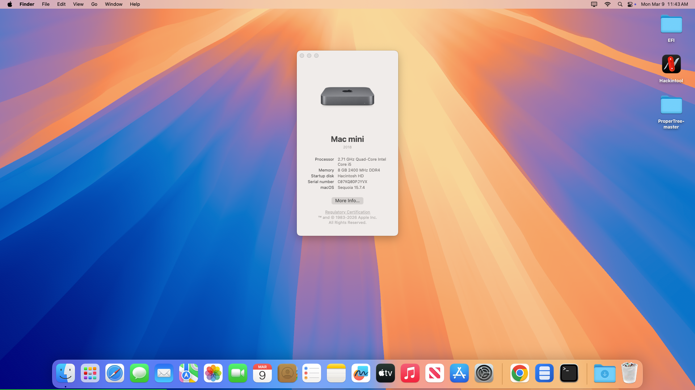

# OpenCore Dell Optiplex 3050 (i5-7500t)
OpenCore Hackintosh configuration example for the DELL Optiplex 3050 Micro with a i5-7500t. 

<i>Dell Optiplex 3050 micro running MacOS Sequoia.</i>

 

***

## OpenCore

<h3>OpenCore 1.0.6</h3>

This is the version of OpenCore used, including bundled files. The included ``config.plist`` targets this version.
 

## macOS

<!-- CHANGE THE IMAGE URL TO THE MAIN OS YOUR CONFIG TARGETS. IMAGE URL LIST BELOW! -->

 
<!-- CHANGE THE HEIGHT WHEN ADDING OR REMOVING SUPPORTED OSES TO THE LIST (Default: 520) -->

<h3>MacOS Sequoia 15.7.4</h3>

This is the version of macOS that this OpenCore configuration currently targets. Other versions of macOS that are compatible with it are listed below. 

#### Supported

 
<h5>macOS Sonoma</h5>
 
<h5>macOS Ventura</h5>
 
<h5>macOS Monterey</h5>
 
<h5>macOS Big Sur</h5>
 
<h5>macOS Catalina</h5>
 
<h5>macOS Mojave</h5>
 
<h5>macOS High Sierra</h5>
 
<h5>macOS Sierra</h5>

 

***

## What works?

### macOS

- [x] MacOS Sequoia
- [x] MacOS Sonoma

### Hardware

- [x] iGPU (Intel HD 630)
- [x] NVMe drives
- [ ] SATA drives (untested)
- [x] USB 3.1 (XHCI)
- [x] Ethernet
- [x] Wi-Fi *via OCLP
- [x] Bluetooth *via OCLP
- [ ] Sound
  
### Software

- [ ] AirDrop
- [x] iMessage
- [x] FaceTime
- [ ] Unlock with Apple Watch
- [ ] QE/CI graphics acceleration
- [x] Metal support (Metal 3)
- [x] Temperature sensors
- [ ] Sleep / Wake
- [x] RTC (protection)
- [x] Hyperthreading
- [x] Virtualization
- [x] Memory bank configuration
  
 

***

## Problems

<ul>
<li><b>Onboard Audio not working</b></li>
Unable to get the builtin speakers or headphone jack to work.

  
</ul>

***

## ACPI

SSDTs used:
- SSDT-EC
- SSDT-MCHC
- SSDT-PLUG
- SSDT-SBUS
***

## Kernel

The following shows the kernel configuration.

### Kexts

Kexts used:
- AMFIPass.kext
- AirportItlwm.kext
- AppleALC.kext
- BlueToolFixup.kext
- IO80211FamilyLegacy.kext
- IOSkywalkFamily.kext
- IntelBTPatcher.kext
- IntelBluetoothFirmware.kext
- Lilu.kext
- NVMeFix.kext
- RealtekRTL8111.kext
- RestrictEvents.kext
- SMCDellSensors.kext
- SMCProcessor.kext
- SMCSuperIO.kext
- USBToolBox.kext
- UTBMap.kext
- VirtualSMC.kext
- WhateverGreen.kext
- XHCI-unsupported.kext

## SMBIOS

### Macmini8,1

Mac Mini model that most closely resembles this USFF.
***

## UEFI

Drivers in use:

- HFSPlus
- OpenRuntime
- OpenCanopy
- ResetNvramEntry
  
***

## Disclaimer

Feel free to try out my configuration. However, I am not responsible for anything caused by using these configurations.
